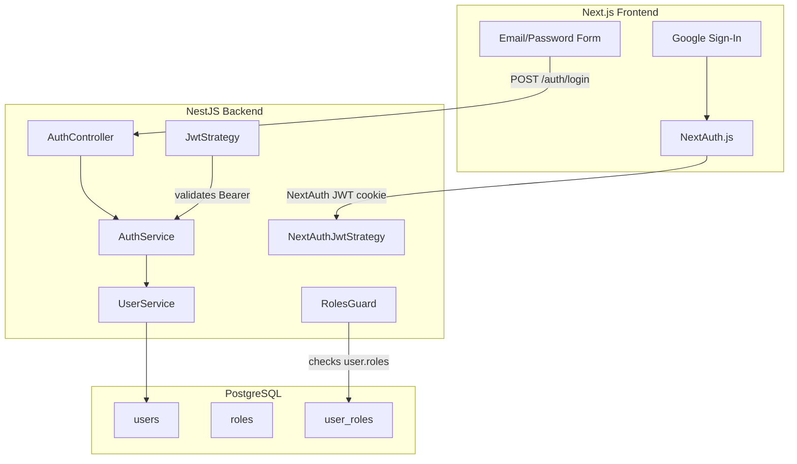

# Keka-style Auth System with RBAC

## Architecture Overview



## Scope

- **Keep**: existing `NextAuthJwtStrategy`, `JwtStrategy`, `DebugInterceptor`, `SharedModule` wiring, barrel exports
- **Replace**: LDAP-based login with email/password (bcrypt) login backed by PostgreSQL `users` table
- **Add**: user registration, Google OAuth via NextAuth (frontend), RBAC guard, PostgreSQL user/role tables, frontend integration doc

---

## Phase 1 -- PostgreSQL User Store

### 1.1 Add TypeORM PostgreSQL connection

Currently `@nestjs/typeorm` and `pg` are in `package.json` but TypeORM is never initialized. Wire it up in a new `TypeormConfigModule` or directly in `AppModule`.

- File: `[src/app.module.ts](src/app.module.ts)`
- Add `TypeOrmModule.forRootAsync(...)` using `DATABASE_`\* env vars (host, port, user, password, name) that already exist in `[src/config/configuration.ts](src/config/configuration.ts)` lines 225-234 with PostgreSQL defaults.

### 1.2 Create entities

Create three TypeORM entities:

- `src/shared/auth/entities/user.entity.ts` -- `users` table

```typescript
// columns: id (uuid PK), email (unique), passwordHash (nullable for OAuth-only users),
// firstName, lastName, googleId (nullable, unique), isActive, createdAt, updatedAt
```

- `src/shared/auth/entities/role.entity.ts` -- `roles` table

```typescript
// columns: id (int PK), name (enum: 'admin' | 'manager' | 'employee'), description
```

- `src/shared/auth/entities/user-role.entity.ts` -- `user_roles` join table

```typescript
// columns: userId (FK -> users.id), roleId (FK -> roles.id), assignedAt
```

### 1.3 Seed default roles

Add a seed script or use TypeORM migration to insert the three roles (`admin`, `manager`, `employee`).

---

## Phase 2 -- Auth Service Refactor

### 2.1 Create `UserService`

New file: `src/shared/auth/user.service.ts`

- `findByEmail(email)` -- query `users` table
- `findByGoogleId(googleId)` -- for NextAuth Google users
- `createLocalUser(dto)` -- hash password with bcrypt, assign default `employee` role
- `findOrCreateGoogleUser(profile)` -- upsert for Google OAuth
- `getUserWithRoles(userId)` -- join users + roles

### 2.2 Refactor `AuthService`

File: `[src/shared/auth/auth.service.ts](src/shared/auth/auth.service.ts)`

- **Replace** `validateLdapUser()` with `validateLocalUser(email, password)` -- looks up user by email, verifies bcrypt hash, returns user with roles.
- **Keep** `login()` (JWT sign logic) but add `roles` array to JWT payload.
- **Keep** `refreshToken()` and `validateJwtPayload()`.
- **Update** `validateNextAuthJwtPayload()` to call `findOrCreateGoogleUser()` so Google-signed-in users get a DB record and roles.

### 2.3 Update `User` interface

File: `[src/shared/auth/auth.service.ts](src/shared/auth/auth.service.ts)` (User interface at top)

Add `roles: string[]` field, remove `isLdapUser`.

### 2.4 Update DTOs

File: `[src/shared/auth/dto/login.dto.ts](src/shared/auth/dto/login.dto.ts)`

- Rename `username` to `email` in `LoginDto`, add `@IsEmail()` validator.
- Add `RegisterDto` class (email, password, firstName, lastName).
- Add `RegisterResponseDto`.
- Update `LoginResponseDto` user shape to include `roles`.

### 2.5 Replace LDAP strategy with Local strategy

- **Delete** or gut `src/shared/auth/strategies/ldap.strategy.ts` -- replace contents with a `LocalStrategy` using `passport-custom` that calls `authService.validateLocalUser(email, password)`.
- Register as `'local'` strategy name.

---

## Phase 3 -- RBAC Guard

### 3.1 Roles decorator

New file: `src/shared/auth/decorators/roles.decorator.ts`

```typescript
export const Roles = (...roles: string[]) => SetMetadata('roles', roles);
```

### 3.2 Roles guard

New file: `src/shared/auth/guards/roles.guard.ts`

- Reads `roles` metadata from route handler.
- Extracts `request.user.roles` (populated by JWT/NextAuth strategy).
- Returns `true` if any user role is in the required set, else throws `ForbiddenException`.

### 3.3 Usage example

```typescript
@Roles('admin', 'manager')
@UseGuards(NextAuthJwtGuard, RolesGuard)
@Get('admin-dashboard')
getAdminDashboard() { ... }
```

---

## Phase 4 -- Controller Updates

### 4.1 Expand `AuthController`

File: `[src/shared/auth/auth.controller.ts](src/shared/auth/auth.controller.ts)`

- **Change** `POST /auth/login` to use `AuthGuard('local')` instead of `AuthGuard('ldap')`.
- **Add** `POST /auth/register` endpoint.
- **Add** `GET /auth/me` endpoint (returns current user profile + roles from JWT).
- **Keep** `POST /auth/refresh-token`.

### 4.2 Update barrel exports

File: `[src/shared/auth/index.ts](src/shared/auth/index.ts)` -- export new guard, decorator, service, and remove LDAP references.

### 4.3 Update `AuthModule`

File: `[src/shared/auth/auth.module.ts](src/shared/auth/auth.module.ts)` -- import `TypeOrmModule.forFeature([UserEntity, RoleEntity, UserRoleEntity])`, register `UserService`, replace `LdapStrategy` with `LocalStrategy`, register `RolesGuard`.

---

## Phase 5 -- Frontend Integration Guide (MD file)

### Create `docs/FRONTEND_AUTH_INTEGRATION.md`

A comprehensive Markdown document covering:

1. **NextAuth.js setup** in Next.js (`next-auth` config in `app/api/auth/[...nextauth]/route.ts`)

- Google provider config
- Credentials provider that calls `POST /api/v1/auth/login` on the backend
- JWT + session callbacks to propagate backend tokens and roles

2. **Auth context and hooks**

- `useSession()` usage
- Protected route wrapper component
- Role-based UI gating helper

3. **API integration patterns**

- Axios/fetch interceptor that attaches the NextAuth session token as `Authorization: Bearer ...` or via `x-nextauth-token` header
- Token refresh flow

4. **Login page implementation**

- Email/password form with validation
- Google sign-in button
- Registration form

5. **RBAC in the frontend**

- Middleware-based route protection by role
- Component-level role checks (`<RoleGate roles={['admin']}>`)

6. **Environment variables needed in Next.js**

- `NEXTAUTH_SECRET`, `NEXTAUTH_URL`, `GOOGLE_CLIENT_ID`, `GOOGLE_CLIENT_SECRET`, `NEXT_PUBLIC_API_URL`

---

## Files Changed Summary

| Action  | Path                                                                                         |
| ------- | -------------------------------------------------------------------------------------------- |
| Modify  | `src/app.module.ts` (add TypeORM PostgreSQL)                                                 |
| Create  | `src/shared/auth/entities/user.entity.ts`                                                    |
| Create  | `src/shared/auth/entities/role.entity.ts`                                                    |
| Create  | `src/shared/auth/entities/user-role.entity.ts`                                               |
| Create  | `src/shared/auth/user.service.ts`                                                            |
| Modify  | `src/shared/auth/auth.service.ts` (replace LDAP with local + Google)                         |
| Modify  | `src/shared/auth/dto/login.dto.ts` (email login + register DTOs)                             |
| Replace | `src/shared/auth/strategies/ldap.strategy.ts` -> local strategy                              |
| Create  | `src/shared/auth/decorators/roles.decorator.ts`                                              |
| Create  | `src/shared/auth/guards/roles.guard.ts`                                                      |
| Modify  | `src/shared/auth/auth.controller.ts` (register, me, local guard)                             |
| Modify  | `src/shared/auth/auth.module.ts` (TypeORM entities, new providers)                           |
| Modify  | `src/shared/auth/index.ts` (updated exports)                                                 |
| Modify  | `src/config/configuration.ts` (ensure `GOOGLE_CLIENT_ID` / `GOOGLE_CLIENT_SECRET` in schema) |
| Create  | `docs/FRONTEND_AUTH_INTEGRATION.md`                                                          |

---

## Environment Variables to Add

```
GOOGLE_CLIENT_ID=your-google-client-id
GOOGLE_CLIENT_SECRET=your-google-client-secret
```

The existing `DATABASE_*` and `JWT_*` variables are already present and sufficient for the PostgreSQL connection and token signing.
